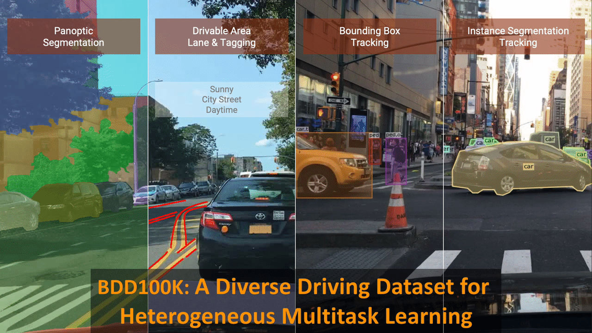

<p align="center"></p>

---

BDD100K is a diverse driving dataset for heterogeneous multitask learning.

[**Homepage**](https://www.bdd100k.com/) |
[**Paper**](https://arxiv.org/abs/1805.04687) |
[**Doc**](https://doc.bdd100k.com) |
[**Questions**](https://github.com/bdd100k/bdd100k/discussions)



We construct BDD100K, the largest open driving video dataset with 100K videos
and 10 tasks to evaluate the exciting progress of image recognition algorithms
on autonomous driving. Each video has 40 seconds and a high resolution. The
dataset represents more than 1000 hours of driving experience with more than 100
million frames. The videos comes with GPU/IMU data for trajectory information.
The dataset possesses geographic, environmental, and weather diversity, which is
useful for training models that are less likely to be surprised by new
conditions. The dynamic outdoor scenes and complicated ego-vehicle motion make
the perception tasks even more challenging. The tasks on this dataset include
image tagging, lane detection, drivable area segmentation, road object
detection, semantic segmentation, instance segmentation, multi-object detection
tracking, multi-object segmentation tracking, domain adaptation, and imitation
learning. This repo contains the toolkit and resources for using [BDD100K
data](https://arxiv.org/abs/1805.04687). To cite the dataset in your paper,

```
@InProceedings{bdd100k,
    author = {Yu, Fisher and Chen, Haofeng and Wang, Xin and Xian, Wenqi and Chen,
              Yingying and Liu, Fangchen and Madhavan, Vashisht and Darrell, Trevor},
    title = {BDD100K: A Diverse Driving Dataset for Heterogeneous Multitask Learning},
    booktitle = {IEEE/CVF Conference on Computer Vision and Pattern Recognition (CVPR)},
    month = {June},
    year = {2020}
}
```
