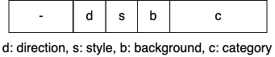
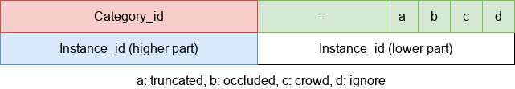

Label Format
=============

This is compatible with the labels generated by
`Scalabel <https://www.scalabel.ai/>`_. The labels are released in `Scalabel Format
<https://doc.scalabel.ai/format.html>`_. A label
`json <https://google.github.io/styleguide/jsoncstyleguide.xml>`_ file is a list
of frame objects with the fields below. Please note that this format is a
superset of the data fields. For example, `box3d` may be absent if the label is
a 2d bounding box, and `intrinsics` may not appear if the exact camera
calibration is unknown.

Categories
~~~~~~~~~~~

Object Detection
^^^^^^^^^^^^^^^^^^

For object detection, 10 classes are evaluated. They are:
::

    1: pedestrian
    2: rider
    3: car
    4: truck
    5: bus
    6: train
    7: motorcycle
    8: bicycle
    9: traffic light
    10: traffic sign

Note that, the field `category_id` range from **1** instead of 0.

Instance Segmentation, Box Tracking, Segmentation Tracking
^^^^^^^^^^^^^^^^^^^^^^^^^^^^^^^^^^^^^^^^^^^^^^^^^^^^^^^^^^^

For instance segmentation, multi object tracking (box tracking), and multi object tracking and segmentation (segmentation tracking),
only the first **8** classes are used and evaluated.

Semantic Segmentation
^^^^^^^^^^^^^^^^^^^^^^^

Meanwhile, for the semantic segmentation task, 19 classes are evaluated. They are:
::

    0:  road 
    1:  sidewalk
    2:  building
    3:  wall
    4:  fence
    5:  pole
    6:  traffic light
    7:  traffic sign
    8:  vegetation
    9:  terrain
    10: sky
    11: person
    12: rider
    13: car
    14: truck
    15: bus
    16: train
    17: motorcycle
    18: bicycle

**255** is used for "unknown" category, and will not be evaluated.

Panoptic Segmentation
^^^^^^^^^^^^^^^^^^^^^^^

For the panoptic segmentation task, 40 classes are evaluated. They are:
::

    0:  unlabeled
    1:  dynamic
    2:  ego vehicle
    3:  ground
    4:  static
    5:  parking
    6:  rail track
    7:  road
    8:  sidewalk
    9:  bridge
    10: building
    11: fence
    12: garage
    13: guard rail
    14: tunnel
    15: wall
    16: banner
    17: billboard
    18: lane divider
    19: parking sign
    20: pole
    21: polegroup
    22: street light
    23: traffic cone
    24: traffic device
    25: traffic light
    26: traffic sign
    27: traffic sign frame
    28: terrain
    29: vegetation
    30: sky
    31: person
    32: rider
    33: bicycle
    34: bus
    35: car
    36: caravan
    37: motorcycle
    38: trailer
    39: train
    40: truck

Classes 1-30 are **stuffs**, 31-40 are **things**.

Drivable Area
^^^^^^^^^^^^^^^^^^^^^^^
For the drivable area task, there are 3 classes. They are:
::

    0: direct
    1: alternative
    2: background

"Background" is not considered during evaluation.

Lane Marking
^^^^^^^^^^^^^^^^^^^^^^^
For the lane marking task, there are 3 sub-tasks: lane categories, lane directions, and lane styles.
There are 9, 3, and 3 classes for each sub-task.

Lane Categories
::

    0: crosswalk
    1: double other
    2: double white
    3: double yellow
    4: road curb
    5: single other
    6: single white
    7: single yellow
    8: background

Lane Directions
::

    0: parallel
    1: vertical
    2: background

Lane Styles
::

    0: solid
    1: dashed
    2: background

"Background" is not considered during evaluation.

Pose Estimation
^^^^^^^^^^^^^^^^^^^^^^^

For pose estimation, 18 classes (joints) are evaluated. They are:
::

    0:  head
    1:  neck
    2:  right_shoulder
    3:  right_elbow
    4:  right_wrist
    5:  left_shoulder
    6:  left_elbow
    7:  left_wrist
    8:  right_hip
    9:  right_knee
    10: right_ankle
    11: left_hip
    12: left_knee
    13: left_ankle
    14: right_hand
    15: left_hand
    16: right_foot
    17: left_foot

Attributes
~~~~~~~~~~~~

BDD100K dataset has some specific properties.

Frame attributes
^^^^^^^^^^^^^^^^^^^^^^^

.. code-block:: yaml

    - weather: "rainy|snowy|clear|overcast|undefined|partly cloudy|foggy"
    - scene: "tunnel|residential|parking lot|undefined|city street|gas stations|highway|"
    - timeofday: "daytime|night|dawn/dusk|undefined"

Label attributes
^^^^^^^^^^^^^^^^^^^^^^^

.. code-block:: yaml

    - occluded: boolean
    - truncated: boolean
    - trafficLightColor: "red|green|yellow|none"
    - areaType: "direct | alternative" (for driving area)
    - laneDirection: "parallel|vertical" (for lanes)
    - laneStyle: "solid | dashed" (for lanes)
    - laneTypes: (for lanes)

.. _seg mask:

Segmentation Formats
~~~~~~~~~~~~~~~~~~~~~~~~~~

We provide labels for all segmentation tasks (semantic segmentation,
drivable area, lane marking, instance segmentation, panoptic segmentation,
and segmentation tracking) in both JSON and **mask** formats.
The JSON format saves each segmentation mask as either polygons or in RLE.
That ``poly2d`` used in JSONs is not of the same format as COCO.
Instead, the ``poly2d`` field stores a Bezier Curve with vertices and control points.
The ``rle`` used is consistent with COCO.
We now use RLE as the main format for segmentation tasks as it is much more
compact and easy to handle compared to the mask format, but the mask format is
still supported.
We do not allow overlap in the segmentation masks as each pixel should be assigned
a single category only.
During evaluation, predictions with overlaps will be ignored.
The mask format handles this naturally, but for the RLE format post-processing
is needed to remove overlaps.
We describe the mask format for each segmentation task below.

Semantic Segmentation
^^^^^^^^^^^^^^^^^^^^^^^

The ground-truth of each image is saved into an one-channel png (8 bits per pixel).
The value of each pixel represents its category. 255 usually means "ignore".

.. _lane mask:

Lane Marking
^^^^^^^^^^^^^^^^^^^^^^^

For lane marking, there are three sub-tasks: lane categories, lane direction and lane styles.
A one-channel png file is used for each image to store all classes information.
The format for a pixel is defined as the image below.
The **3-th** bit and the **4-th** bit are for **direction** and **style**.
The **last 3** bits are for **category**.
Most importantly, the **5**-th bit is to indicate whether this pixel belongs to the **background** (0: lane, 1: background).

.. _bitmask:

Instance Segmentation
^^^^^^^^^^^^^^^^^^^^^^^^^^

The labels for **instance segmentation**, **panoptic segmentation** and **segmentation tracking**
are saved as bitmasks, where the labels for each image are stored in an **RGBA** png file.
For the RGBA image, the first byte, R, is used for the category id and ranges from 1 (0 is used for the background).
G is for the instance attributes. Currently, four attributes are used, and they are "truncated", "occluded", "crowd" and "ignore".
Note that boxes with "crowd" or "ignore" labels will not be considered during evaluation.
The above four attributes are stored in least significant bits of G. Given this, ``G = (truncated << 3) + (occluded << 2) + (crowd << 1) + ignore``
. Finally, the B channel store the "ann_id" for instance segmentation and the A channel for segmentation tracking,
which can be computed as ``(B << 8) + A``. The below image is for reference.

Format Conversion
~~~~~~~~~~~~~~~~~~

Coordinate System
^^^^^^^^^^^^^^^^^^

During our labeling, we regard the top-left corner of the most top-left pixel as (0, 0).
In our conversion scripts, the width is computed as :code:`x2 - x1 + 1` and height is computed as :code:`y2 - y1 + 1`,
following the Scalabel format.
This manner is consistent with `MMDetection 1.x <https://github.com/open-mmlab/mmdetection/releases/tag/v1.2.0>`_ and
`maskrcnn-benchmark <https://github.com/facebookresearch/maskrcnn-benchmark>`_.
Note that, `pycocotools <https://pypi.org/project/pycocotools/>`_,
`MMDetection 2.x <https://github.com/open-mmlab/mmdetection>`_, and
`Detectron2 <https://github.com/facebookresearch/detectron2>`_ adopt a different definition.
For these, you can use ``to_coco`` to convert the annotations to COCO format, which will be consistent.

from_coco
^^^^^^^^^^^^^^^^^^

``from_coco`` converts COCO format JSON files into BDD100K format:
::
    
    python3 -m bdd100k.label.from_coco -i ${input_file} -o ${out_path} [--nproc ${process_num}]

- `process_num`: the number of processes used for the conversion. Default as 4.

to_mask
^^^^^^^^^^^^^^^^^^

You can run the conversion from poly2d to masks/bitmasks by this command:
::
    
    python3 -m bdd100k.label.to_mask -m sem_seg|drivable|lane_mark|ins_seg|pan_seg|seg_track \
        -i ${in_path} -o ${out_path} [--nproc ${process_num}]

- `process_num`: the number of processes used for the conversion. Default as 4.

to_color
^^^^^^^^^^^^^^^^^^

You can run the conversion from masks/bitmasks to colormaps by this command:
::
    
    python3 -m bdd100k.label.to_color -m sem_seg|ins_seg|seg_track \
        -i ${in_path} -o ${out_path} [--nproc ${process_num}]

- `process_num`: the number of processes used for the conversion. Default as 4.

 
to_coco
^^^^^^^^^^^^^^^^^^

``to_coco`` converts BDD100K JSONs/masks into COCO format.
For detection, box tracking, and pose estimation, run this command:
::
   
    python3 -m bdd100k.label.to_coco -m det|box_track|pose \
        -i ${in_path} -o ${out_path} [--nproc ${process_num}]

- `process_num`: the number of processes used for the conversion. Default as 4.

For instance segmentation and segmentation tracking, converting from
JSON, JSON + Bitmasks, and from Bitmasks are all supported.
For RLEs, use this command:
::
   
    python3 -m bdd100k.label.to_coco -m ins_seg|seg_track \
        -i ${in_path} -o ${out_path} [--nproc ${process_num}]

For Bitmasks, use this command:
::
   
    python3 -m bdd100k.label.to_coco -m ins_seg|seg_track \
        -i ${in_path} -o ${out_path} -mb ${mask_base} [--nproc ${process_num}]

- `mask_base`: the path to the bitmasks

If you only have Bitmasks in hand and don't use the `scalabel_id` field, you can use this command:
::
   
    python3 -m bdd100k.label.to_coco -m ins_seg|seg_track --only-mask \
        -i ${mask_base} -o ${out_path} [--nproc ${process_num}]

- `mask_base`: the path to the bitmasks

to_rle
^^^^^^^^^^^^

You can run the conversion from masks/bitmasks to RLEs by this command:
::
    
    python3 -m bdd100k.label.to_rle -m sem_seg|drivable|ins_seg|seg_track \
        -i ${in_path} -o ${out_path} [--nproc ${process_num}]

- `process_num`: the number of processes used for the conversion. Default as 4.
